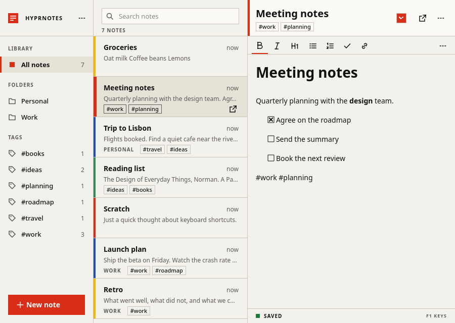

# Hyprnotes

Markdown notes for Hyprland. One small native process gives you an organizer and as many floating sticky notes as you want. Your notes stay plain `.md` files in a folder you pick.



## What it does

- Edit Markdown visually, with a formatting toolbar, or switch to source mode. Opening a note never rewrites it.
- Search, tags and folders in an organizer. Pop any note out into its own sticky window.
- Autosave, crash recovery, and a clear conflict prompt if another program changes a note you have open.
- Flat modernist look in light and dark. Import your own theme (Hyprnotes JSON, base16 or VS Code).
- Lua plugins for commands, typing triggers, side panels, `[[link]]` completion and a command palette (Ctrl+Shift+P), with a plugin browser built in.
- Lives in the tray, runs as a single instance, and stays light on memory and CPU.

Written in C++20 with Qt 6. Targets Arch Linux and Hyprland on Wayland.

## Install

You need Arch Linux (or another pacman-based distro) on x86_64 and a Wayland session. These steps build the package from a clone, which works without a release.

1. Install the build tools. The runtime libraries come in automatically when you install the package.

   ```sh
   sudo pacman -S --needed git base-devel cmake ninja
   ```

2. Clone the repository and build the package. This runs as your normal user and installs nothing; the package lands in `packaging/out/pkg/`.

   ```sh
   git clone https://github.com/RolittapesReal/hyprnotes.git
   cd hyprnotes
   packaging/build-package.sh
   ```

3. Install it. pacman lists what it will do and asks before it continues.

   ```sh
   sudo pacman -U packaging/out/pkg/hyprnotes-*.pkg.tar.zst
   ```

4. Start it. On first launch it asks where to keep your notes (default `~/Notes/Hyprnotes`) and then opens the organizer.

   ```sh
   hyprnotes
   ```

To update, pull, rebuild and run step 3 again; close Hyprnotes first so the new version starts. `sudo pacman -R hyprnotes` removes it and leaves your notes and settings alone.

If you'd rather not build, download the signed package from the [releases page](https://github.com/RolittapesReal/hyprnotes/releases). [docs/install.md](docs/install.md) covers verifying it, the bootstrap script, the tray and Hyprland setup, and what to do when something goes wrong.

## Use

```
hyprnotes [--show-organizer | --new-note | --background]
```

Running it again talks to the instance that is already open. The tray icon needs Waybar's `tray` module. Window rules and key binds for Hyprland are an opt-in snippet in `/usr/share/hyprnotes/hyprland/`; nothing edits your config for you.

Settings live in `~/.config/hyprnotes/`, see [docs/theme-reference.md](docs/theme-reference.md).

## Plugins

Plugins let you change how the app behaves. They are not reviewed by this project. A plugin can read or change your notes and, depending on its permissions, send data over the network, so only install plugins from sources you trust. Each plugin stays off until you approve its permissions.

Settings, Plugins, Browse lists plugins from the [hyprnotes-plugins](https://github.com/RolittapesReal/hyprnotes-plugins) registry. It only contacts GitHub after you open the tab and agree to a notice. Each download is checked against the registry's hash before the usual permission dialog appears. That catches a damaged download, not a plugin you shouldn't trust. Native plugins are listed but can't be installed from there yet.

Start with [docs/plugins.md](docs/plugins.md). `hyprnotes --new-plugin NAME` creates a working template, and there are examples in `examples/plugins/`.

## Build from source

You need cmake, ninja, qt6-base, qt6-svg, md4c, sqlite, lua and libarchive.

```sh
cmake -S . -B build -G Ninja
cmake --build build
ctest --test-dir build
```

## Status

Version 0.2.0, early. It has only been tested on one Arch and Hyprland 0.56 machine. A clean-system install, the Hyprland rules on other setups, and long-running use are not covered yet.

## License

MIT, see [LICENSE](LICENSE).
